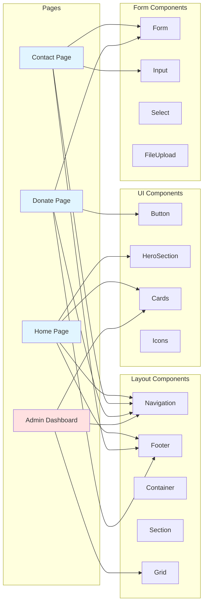
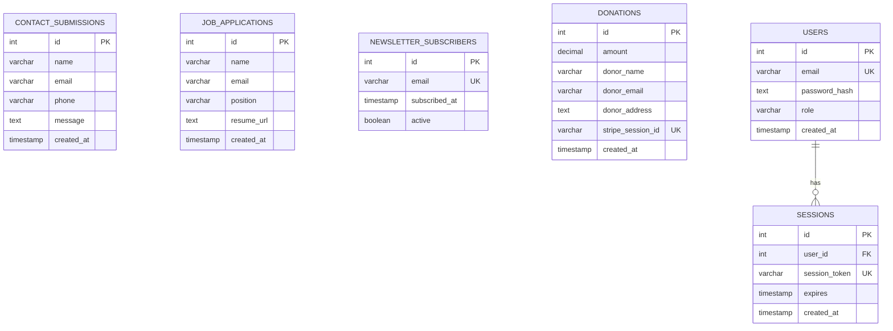
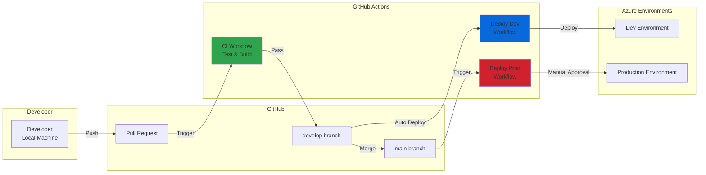
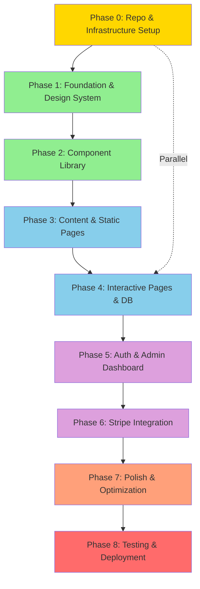
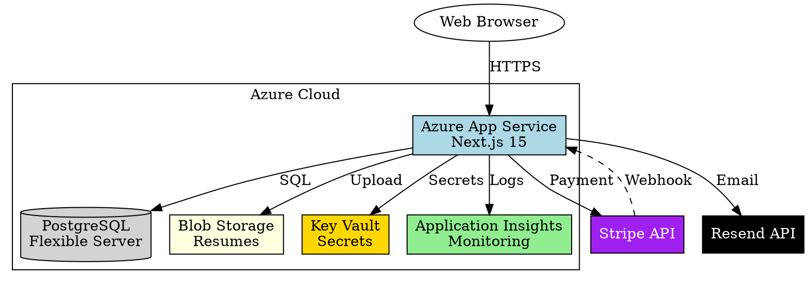

# Architecture Diagrams

## System Architecture (Mermaid)

```mermaid
graph TB
    subgraph "Client"
        Browser[Web Browser]
    end
    
    subgraph "Azure Cloud"
        subgraph "Frontend"
            AppService[Azure App Service<br/>Next.js 15]
            CDN[Azure CDN<br/>Static Assets]
        end
        
        subgraph "Backend Services"
            KeyVault[Azure Key Vault<br/>Secrets]
            Storage[Azure Blob Storage<br/>Resume Files]
            DB[(Azure PostgreSQL<br/>Flexible Server)]
            Insights[Application Insights<br/>Monitoring]
        end
        
        subgraph "External Services"
            Stripe[Stripe API<br/>Payments]
            Resend[Resend API<br/>Emails]
        end
    end
    
    Browser -->|HTTPS| AppService
    AppService -->|Static Assets| CDN
    AppService -->|Secrets| KeyVault
    AppService -->|File Upload| Storage
    AppService -->|SQL Queries| DB
    AppService -->|Logs/Metrics| Insights
    AppService -->|Payment Processing| Stripe
    AppService -->|Send Emails| Resend
    Stripe -->|Webhooks| AppService
    
    style AppService fill:#0078d4
    style DB fill:#336791
    style KeyVault fill:#ffd700
    style Storage fill:#00a4ef
    style Stripe fill:#635bff
    style Resend fill:#000000
```



## Component Architecture



## Database Schema



## CI/CD Pipeline



## Migration Phase Dependencies



---

## Graphviz DOT Format (for later rendering)

If you install Graphviz later, here are the same diagrams in DOT format:

### System Architecture (DOT)


### Component Hierarchy (DOT)
```dot
digraph ComponentHierarchy {
    rankdir=LR;
    node [shape=box];
    
    // Pages
    Home [label="Home Page", fillcolor=lightblue, style=filled];
    Contact [label="Contact Page", fillcolor=lightblue, style=filled];
    Donate [label="Donate Page", fillcolor=lightblue, style=filled];
    Admin [label="Admin Dashboard", fillcolor=lightcoral, style=filled];
    
    // Layout Components
    subgraph cluster_layout {
        label="Layout Components";
        Nav [label="Navigation"];
        Footer [label="Footer"];
        Container [label="Container"];
    }
    
    // UI Components
    subgraph cluster_ui {
        label="UI Components";
        Button [label="Button"];
        Hero [label="HeroSection"];
        Card [label="Card"];
    }
    
    // Form Components
    subgraph cluster_forms {
        label="Form Components"];
        Form [label="Form"];
        Input [label="Input"];
        Upload [label="FileUpload"];
    }
    
    // Relationships
    Home -> Nav;
    Home -> Hero;
    Home -> Card;
    Home -> Footer;
    
    Contact -> Nav;
    Contact -> Form;
    Contact -> Input;
    Contact -> Footer;
    
    Donate -> Nav;
    Donate -> Form;
    Donate -> Button;
    Donate -> Footer;
    
    Admin -> Nav;
    Admin -> Card;
    Admin -> Container;
}
```

---

## How to Use These Diagrams

### Mermaid Diagrams
1. **GitHub**: Paste into README.md or any .md file - renders automatically
2. **VS Code**: Install "Markdown Preview Mermaid Support" extension
3. **Online**: Use https://mermaid.live/ to render and export
4. **Documentation**: Most modern doc tools support Mermaid

### Graphviz DOT Diagrams
1. **Install Graphviz**: `winget install graphviz` or download from graphviz.org
2. **Render to PNG**: `dot -Tpng architecture.dot -o architecture.png`
3. **Render to SVG**: `dot -Tsvg architecture.dot -o architecture.svg`
4. **Render to PDF**: `dot -Tpdf architecture.dot -o architecture.pdf`

### Export Options
- PNG: For presentations and documents
- SVG: For web and scalable graphics
- PDF: For high-quality prints
- Interactive HTML: `dot -Tsvg architecture.dot | dot -Tcmapx > architecture.html`
